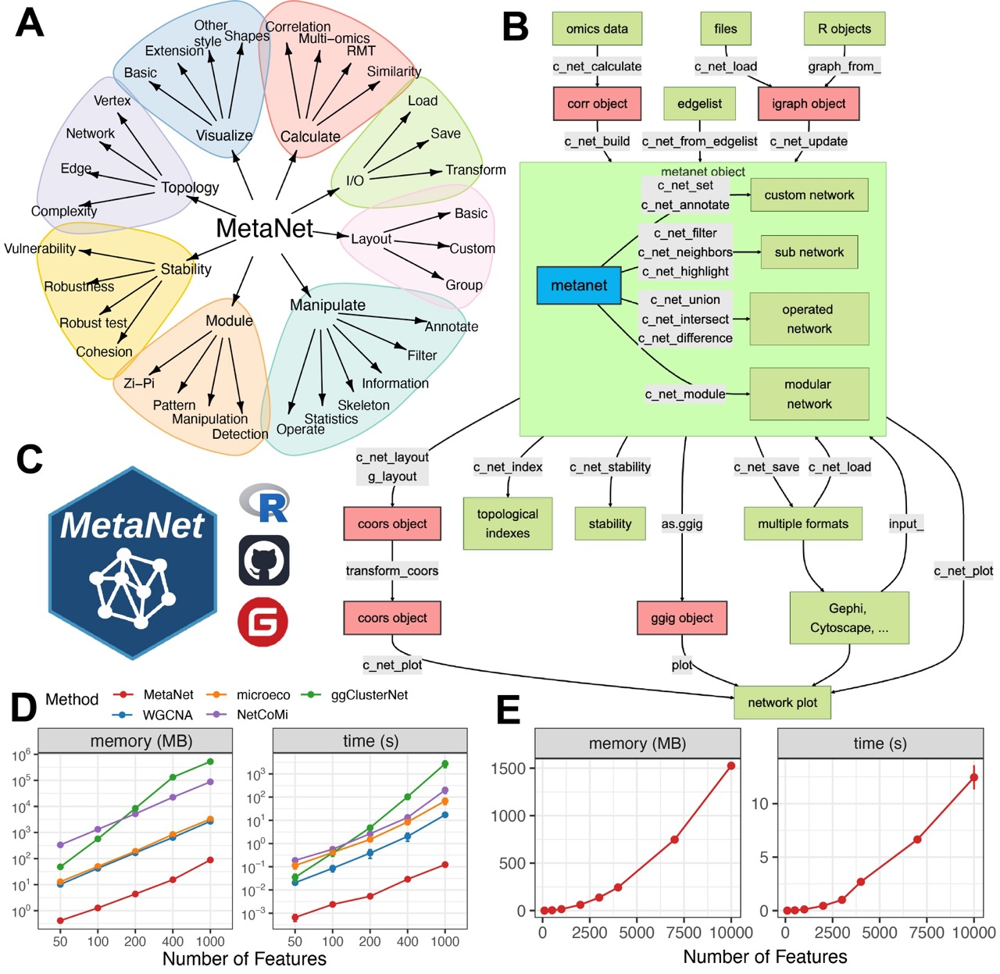

---
output:
  github_document:
    html_preview: false
---

<!-- README.md is generated from README.Rmd. Please edit that file -->

```{r, include = FALSE}
knitr::opts_chunk$set(
  collapse = TRUE,
  comment = "#>",
  fig.path = "man/figures/README-",
  out.width = "100%"
)
devtools::load_all("~/Documents/R/MetaNet/MetaNet/")
library(badger)
```

```{r include=FALSE,eval=FALSE}
library(hexSticker)
showtext::showtext_auto()

sticker("~/Documents/R/test/icons/网络.png",
  package = "MetaNet",
  p_size = 30, p_color = "black", p_y = 1.4,
  p_fontface = "bold.italic", p_family = "Comic Sans MS",
  s_x = 1, s_y = .75, s_width = 0.4, s_height = 0.4,
  h_fill = "#D8E2DC", h_color = "#83A98C",
  filename = "man/figures/MetaNet.png", dpi = 300
)
```

# MetaNet 

<!-- badges: start -->
[](https://github.com/Asa12138/MetaNet/actions/workflows/R-CMD-check.yaml)
`r badge_custom("blog", "@asa", "blue", "https://asa-blog.netlify.app/")`
`r badge_cran_download("MetaNet", type = "grand-total")`
`r badge_cran_download("MetaNet", type = "last-month")`
`r badge_cran_release("MetaNet","green")`
`r badge_devel("Asa12138/MetaNet", color = "green")`
<!-- badges: end -->

MetaNet: Network analysis for multi-omics 

The HTML documentation of the latest version is available at [Github page](https://asa12138.github.io/MetaNet/).


## Tutorial📖

Please go to **<https://bookdown.org/Asa12138/metanet_book/>** for the full vignette.


## Installation

You can install the released version of `MetaNet` from [CRAN](https://CRAN.R-project.org) with:

``` r
install.packages("MetaNet")
```

You can install the development version of `MetaNet` from [GitHub](https://github.com/) with:

``` r
# install.packages("devtools")
devtools::install_github("Asa12138/MetaNet")
```

## Workflow overview



**Figure 1. Overview of the MetaNet workflow and its high-efficiency computation.**
(A) Functional modules of MetaNet, visualized using MetaNet itself.
(B) Detailed workflow of MetaNet. Green boxes indicate data objects, red boxes represent MetaNet-specific objects, and gray boxes denote core functions.
(C) MetaNet logo and its available code repositories and platforms.
(D) Line plots comparing memory usage and runtime for correlation-based network construction across different R packages. Error bars represent standard deviation (SD).
(E) Line plots showing MetaNet’s performance on increasingly larger datasets in terms of memory usage and runtime. Error bars represent SD.


**Figure 2. MetaNet supports flexible and intuitive network manipulation.**
(A) Initial multi-omics network constructed without annotations.
(B) Annotated multi-omics network using the "c_net_set" function. Node shape indicates omics type, color represents omics subtypes, size denotes average abundance, edge color indicates positive or negative correlation, edge type distinguishes intra- and inter-omics connections, and edge width reflects the absolute value of the correlation coefficient.
(C) Subnetwork filtered from intra-omics interactions between the Microbiome and Metabolome layers using "c_net_filter".
(D) Highlighted nodes centered on "s__Dongia_mobilis" and its neighbors using "c_net_highlight".
(E) Community detection and modular visualization using "c_net_module".
(F) Chord diagram displaying the proportion of edges between modules.
(G) Skeleton network across omics subtypes at a grouped level using "c_net_skeleton".
(H) Operations among networks: "c_net_union" merges net1 and net2, "c_net_intersect" extracts shared nodes and edges, and "c_net_difference" isolates net1-specific nodes and edges. All networks shown are based on simulated data and are for illustrative purposes only.


**Figure 3. MetaNet enables diverse and powerful network layout strategies.**
(A) Application of 24 out of more than 40 built-in layout algorithms from "c_net_layout" on the Zachary Karate Club network.
(B) Layout generated within a star using "spatstat_layout".
(C) Layout applied within the map of Australia using "spatstat_layout".
(D) Grouped network layout consisting of four subgroups arranged with "with_fr()", "on_grid()", "as_polycircle(3)", and "as_polygon(3)" within a human-body schematic. All visualization elements were rendered entirely in MetaNet without manual adjustment.
(E) Modular network visualized using "g_layout_circlepack".
(F) Three-layer modular structure visualized using "g_layout_multi_layer". All networks shown are based on simulated data and carry no biological interpretation.

## Citation

Please cite:

Chen Peng (2025). MetaNet: A Comprehensive R Package for Network Analysis of Omics Data. _R package_, <https://github.com/Asa12138/MetaNet>.

## Need helps?

If you have questions/issues, please visit [MetaNet homepage](https://github.com/Asa12138/MetaNet) first. Your problems are mostly documented. If you think you found a bug, please post on [github issue](https://github.com/Asa12138/MetaNet/issues).
