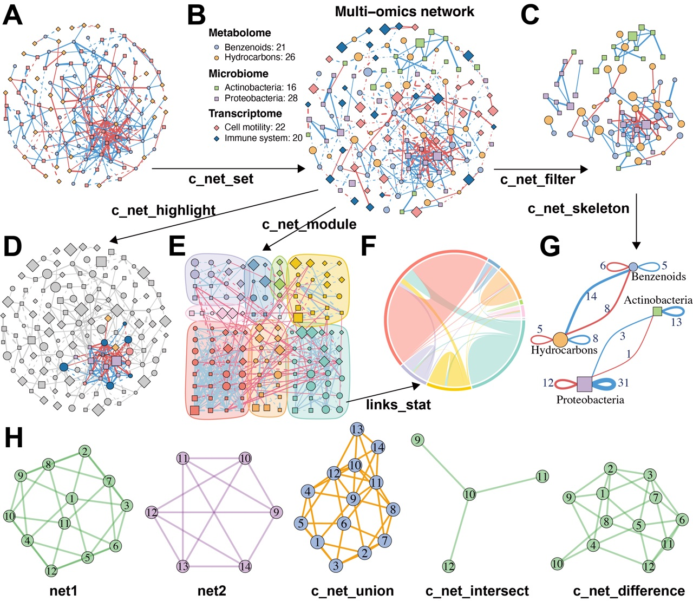
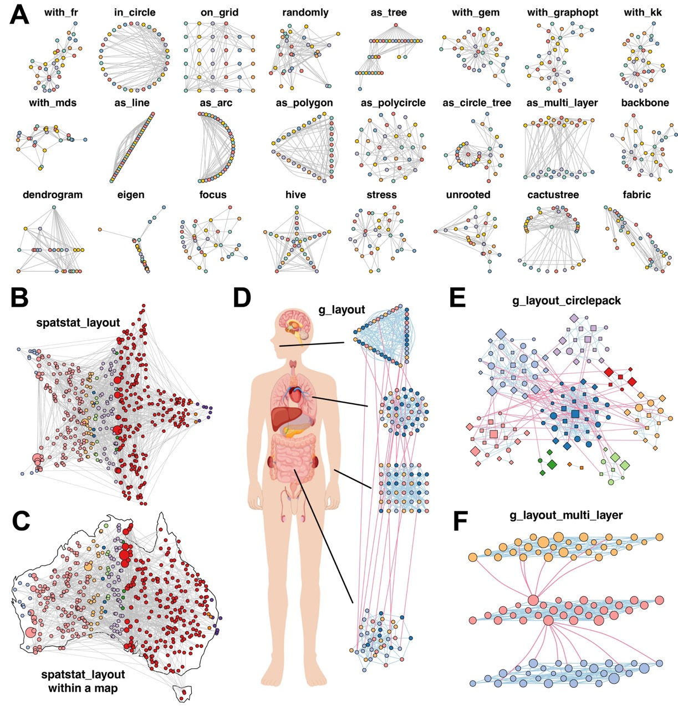
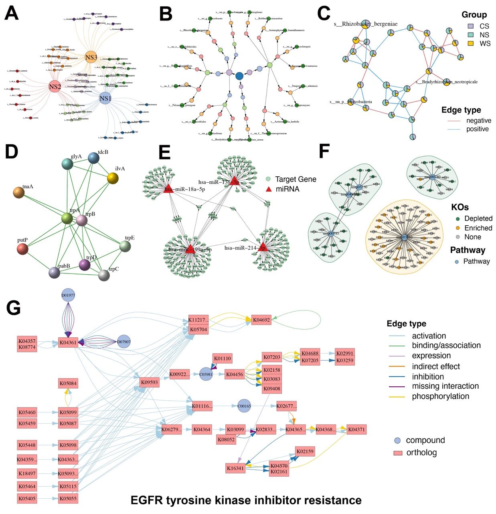

---
output:
  github_document:
    html_preview: false
---

<!-- README.md is generated from README.Rmd. Please edit that file -->

```{r, include = FALSE}
knitr::opts_chunk$set(
  collapse = TRUE,
  comment = "#>",
  fig.path = "man/figures/README-",
  out.width = "100%"
)
devtools::load_all("~/Documents/R/MetaNet/MetaNet/")
library(badger)
```

```{r include=FALSE,eval=FALSE}
library(hexSticker)
showtext::showtext_auto()

sticker("~/Documents/R/test/icons/网络.png",
  package = "MetaNet",
  p_size = 30, p_color = "black", p_y = 1.4,
  p_fontface = "bold.italic", p_family = "Comic Sans MS",
  s_x = 1, s_y = .75, s_width = 0.4, s_height = 0.4,
  h_fill = "#D8E2DC", h_color = "#83A98C",
  filename = "man/figures/MetaNet.png", dpi = 300
)

tibble::tribble(
  ~from, ~to,
  1L, 2L,
  2L, 3L,
  3L, 4L,
  4L, 5L,
  5L, 6L,
  6L, 1L,
  7L, 1L,
  7L, 2L,
  7L, 3L,
  7L, 4L,
  7L, 8L,
  8L, 1L,
  8L, 4L,
  8L, 5L
) %>%
  graph_from_data_frame(
    directed = FALSE
  ) %>%
  as.metanet() -> g
c_net_layout(make_ring(6)) -> co
co <- rbind(
  co,
  data.frame(
    name = c("7", "8"),
    X = c(-0.3, 0.3),
    Y = c(0.3, -0.1)
  )
)
png("~/Documents/R/test/icons/test.png", width = 400, height = 400, bg = "transparent")
c_net_plot(g, co,
  legend = F, vertex_size_range = list(40),
  edge_width_range = 10 * 2, labels_num = 0, vertex.frame.width = 0,
  vertex.color = "white", edge.color = "white"
)
dev.off()

sticker("~/Documents/R/test/icons/test.png",
  package = "MetaNet",
  p_size = 30, p_color = "white", p_y = 1.4,
  p_fontface = "bold.italic", p_family = "Comic Sans MS",
  s_x = 1, s_y = .7, s_width = 0.6, s_height = 0.4, asp = 0.8,
  h_fill = "#1D4A76", h_color = "#4393C3",
  filename = "man/figures/MetaNet.png", dpi = 300
)
```

# MetaNet 

<!-- badges: start -->
[](https://github.com/Asa12138/MetaNet/actions/workflows/R-CMD-check.yaml)
`r badger::badge_doi("10.1101/2025.06.26.661636","yellow")`
`r badge_custom("blog", "@asa", "blue", "https://asa-blog.netlify.app/")`
`r badge_cran_download("MetaNet", type = "grand-total")`
`r badge_cran_download("MetaNet", type = "last-month")`
`r badge_cran_release("MetaNet","green")`
`r badge_devel("Asa12138/MetaNet", color = "green")`
<!-- badges: end -->

MetaNet: Network analysis for multi-omics 

The HTML documentation of the latest version is available at [Github page](https://asa12138.github.io/MetaNet/).


## Tutorial📖

Please go to **<https://bookdown.org/Asa12138/metanet_book/>** for the full vignette.


## Installation

You can install the released version of `MetaNet` from [CRAN](https://CRAN.R-project.org) with:

``` r
install.packages("MetaNet")
```

You can install the development version of `MetaNet` from [GitHub](https://github.com/) with:

``` r
# install.packages("devtools")
devtools::install_github("Asa12138/MetaNet")
```


## Workflow overview


**Figure 1. Overview of the MetaNet workflow and its high-efficiency computation.**



**Figure 2. MetaNet supports flexible and intuitive network manipulation.**




**Figure 3. MetaNet enables diverse and powerful network layout strategies.**




**Figure 4. Diverse specialized network visualizations by MetaNet.**

## Citation

Please cite:

1. Peng, C. et al. MetaNet: a scalable and integrated tool for reproducible omics network analysis. 2025.06.26.661636 Preprint at https://doi.org/10.1101/2025.06.26.661636 (2025).


## Need helps?

If you have questions/issues, please visit [MetaNet homepage](https://github.com/Asa12138/MetaNet) first. Your problems are mostly documented. If you think you found a bug, please post on [github issue](https://github.com/Asa12138/MetaNet/issues).
