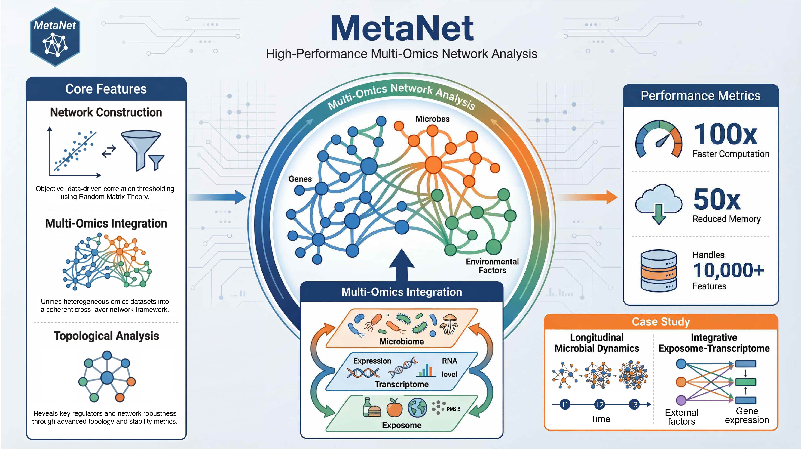

<!-- README.md is generated from README.Rmd. Please edit that file -->

# MetaNet 

<!-- badges: start -->

[](https://github.com/Asa12138/MetaNet/actions/workflows/R-CMD-check.yaml)
[](https://doi.org/10.1101/2025.06.26.661636)
[](https://asa-blog.netlify.app/)
[](https://cran.r-project.org/package=MetaNet)
[](https://cran.r-project.org/package=MetaNet)
[](https://cran.r-project.org/package=MetaNet)
[](https://github.com/Asa12138/MetaNet)
<!-- badges: end -->

MetaNet: Network analysis for multi-omics

The HTML documentation of the latest version is available at [Github
page](https://asa12138.github.io/MetaNet/).

## Tutorial📖

Please go to **<https://bookdown.org/Asa12138/metanet_book/>** for the
full vignette.


## Installation

You can install the released version of `MetaNet` from
[CRAN](https://CRAN.R-project.org) with:

``` r
install.packages("MetaNet")
```

You can install the development version of `MetaNet` from
[GitHub](https://github.com/) with:

``` r
# install.packages("devtools")
devtools::install_github("Asa12138/MetaNet")
```



## Workflow overview


**Figure 1. Overview of the MetaNet workflow and its high-efficiency
computation.**


**Figure 2. MetaNet supports flexible and intuitive network
manipulation.**


**Figure 3. MetaNet enables diverse and powerful network layout
strategies.**


**Figure 4. Diverse specialized network visualizations by MetaNet.**

## Citation

Please cite:

1.  Peng, C. et al. MetaNet: a scalable and integrated tool for
    reproducible omics network analysis. 2025.06.26.661636 Preprint at
    <https://doi.org/10.1101/2025.06.26.661636> (2025).

## Need helps?

If you have questions/issues, please visit [MetaNet
homepage](https://github.com/Asa12138/MetaNet) first. Your problems are
mostly documented. If you think you found a bug, please post on [github
issue](https://github.com/Asa12138/MetaNet/issues).
