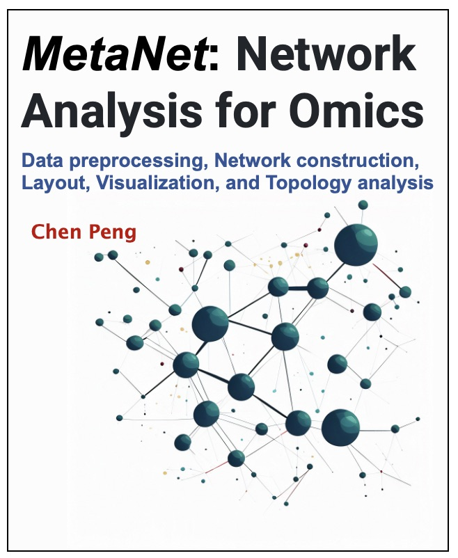
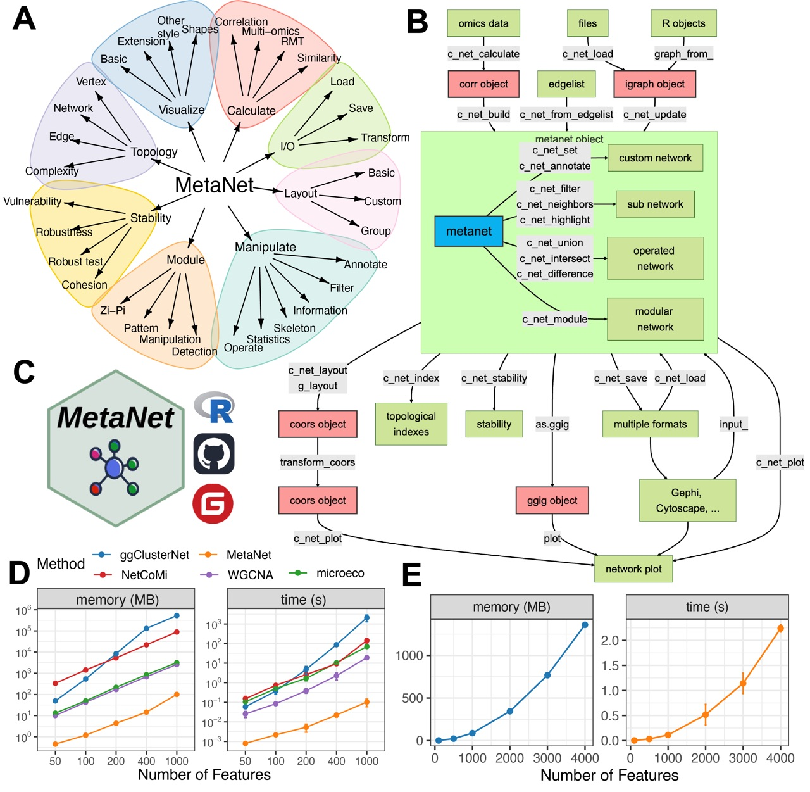
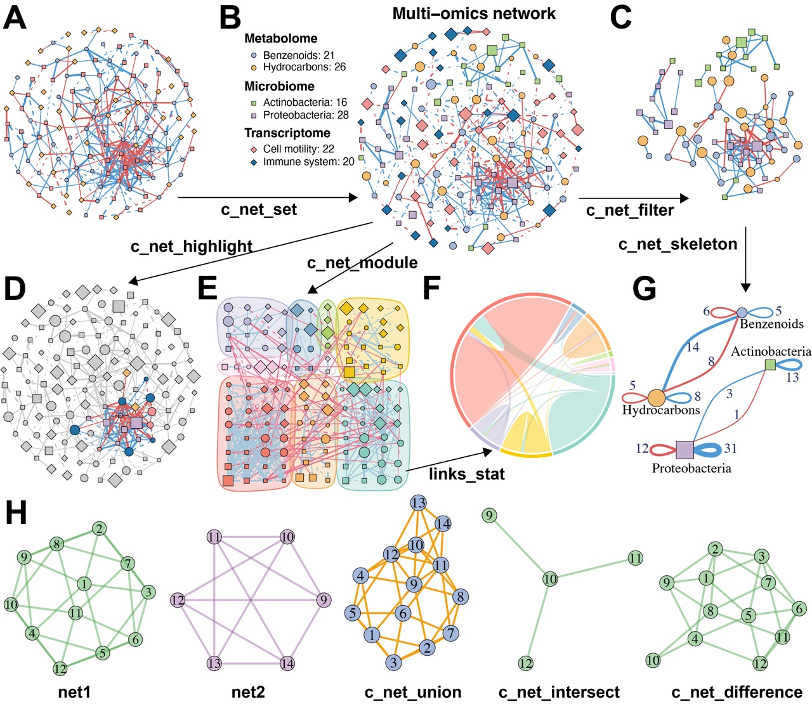
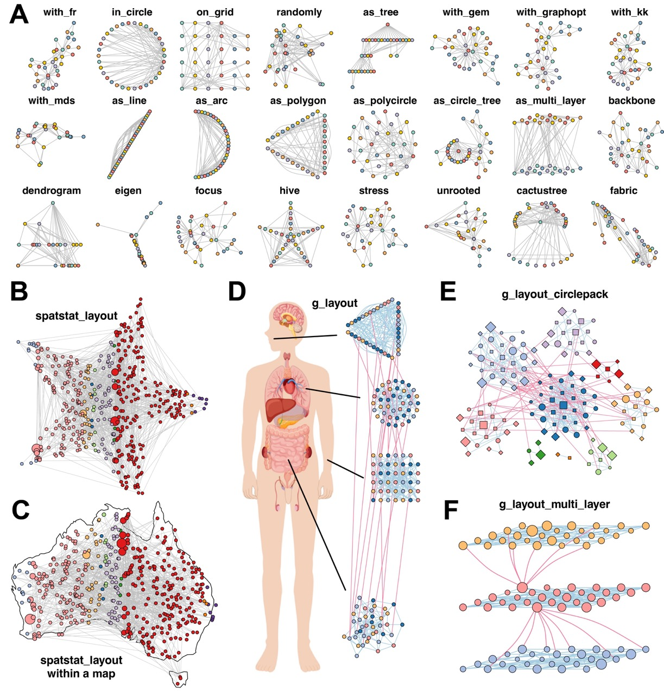

<!-- README.md is generated from README.Rmd. Please edit that file -->

# MetaNet 

<!-- badges: start -->

[](https://github.com/Asa12138/MetaNet/actions/workflows/R-CMD-check.yaml)
[](https://asa-blog.netlify.app/)
[](https://cran.r-project.org/package=MetaNet)
[](https://cran.r-project.org/package=MetaNet)
[](https://cran.r-project.org/package=MetaNet)
[](https://github.com/Asa12138/MetaNet)
<!-- badges: end -->

MetaNet: Network analysis for multi-omics

The HTML documentation of the latest version is available at [Github
page](https://asa12138.github.io/MetaNet/).

## Tutorial📖

Please go to **<https://bookdown.org/Asa12138/metanet_book/>** for the
full vignette.



## Installation

You can install the released version of `MetaNet` from
[CRAN](https://CRAN.R-project.org) with:

``` r
install.packages("MetaNet")
```

You can install the development version of `MetaNet` from
[GitHub](https://github.com/) with:

``` r
# install.packages("devtools")
devtools::install_github("Asa12138/MetaNet")
```

## Workflow overview



**Figure 1. Overview of the MetaNet workflow and its high-efficiency
computation.** (A) Functional modules of MetaNet, visualized using
MetaNet itself. (B) Detailed workflow of MetaNet. Green boxes indicate
data objects, red boxes represent MetaNet-specific objects, and gray
boxes denote core functions. (C) MetaNet logo and its available code
repositories and platforms. (D) Line plots comparing memory usage and
runtime for correlation-based network construction across different R
packages. Error bars represent standard deviation (SD). (E) Line plots
showing MetaNet’s performance on increasingly larger datasets in terms
of memory usage and runtime. Error bars represent SD.



**Figure 2. MetaNet supports flexible and intuitive network
manipulation.** (A) Initial multi-omics network constructed without
annotations. (B) Annotated multi-omics network using the “c_net_set”
function. Node shape indicates omics type, color represents omics
subtypes, size denotes average abundance, edge color indicates positive
or negative correlation, edge type distinguishes intra- and inter-omics
connections, and edge width reflects the absolute value of the
correlation coefficient. (C) Subnetwork filtered from intra-omics
interactions between the Microbiome and Metabolome layers using
“c_net_filter”. (D) Highlighted nodes centered on “s\_\_Dongia_mobilis”
and its neighbors using “c_net_highlight”. (E) Community detection and
modular visualization using “c_net_module”. (F) Chord diagram displaying
the proportion of edges between modules. (G) Skeleton network across
omics subtypes at a grouped level using “c_net_skeleton”. (H) Operations
among networks: “c_net_union” merges net1 and net2, “c_net_intersect”
extracts shared nodes and edges, and “c_net_difference” isolates
net1-specific nodes and edges. All networks shown are based on simulated
data and are for illustrative purposes only.



**Figure 3. MetaNet enables diverse and powerful network layout
strategies.** (A) Application of 24 out of more than 40 built-in layout
algorithms from “c_net_layout” on the Zachary Karate Club network. (B)
Layout generated within a star using “spatstat_layout”. (C) Layout
applied within the map of Australia using “spatstat_layout”. (D) Grouped
network layout consisting of four subgroups arranged with “with_fr()”,
“on_grid()”, “as_polycircle(3)”, and “as_polygon(3)” within a human-body
schematic. All visualization elements were rendered entirely in MetaNet
without manual adjustment. (E) Modular network visualized using
“g_layout_circlepack”. (F) Three-layer modular structure visualized
using “g_layout_multi_layer”. All networks shown are based on simulated
data and carry no biological interpretation.

## Citation

Please cite:

Chen Peng (2025). MetaNet: A Comprehensive R Package for Network
Analysis of Omics Data. *R package*,
<https://github.com/Asa12138/MetaNet>.

## Need helps?

If you have questions/issues, please visit [MetaNet
homepage](https://github.com/Asa12138/MetaNet) first. Your problems are
mostly documented. If you think you found a bug, please post on [github
issue](https://github.com/Asa12138/MetaNet/issues).
