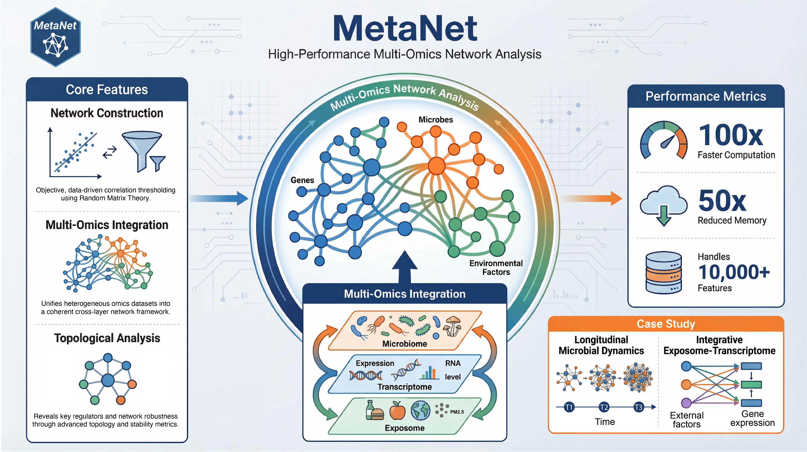
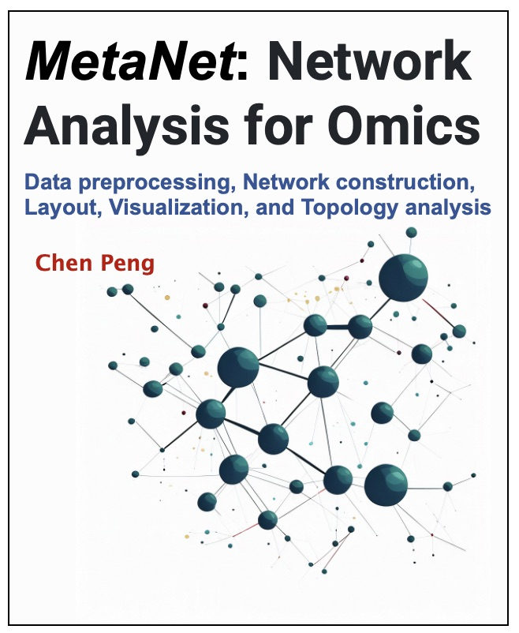
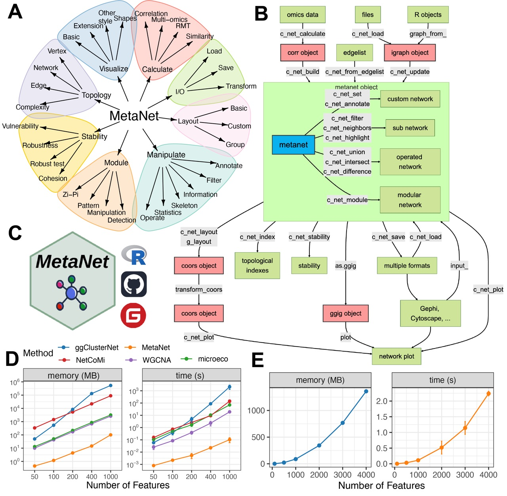
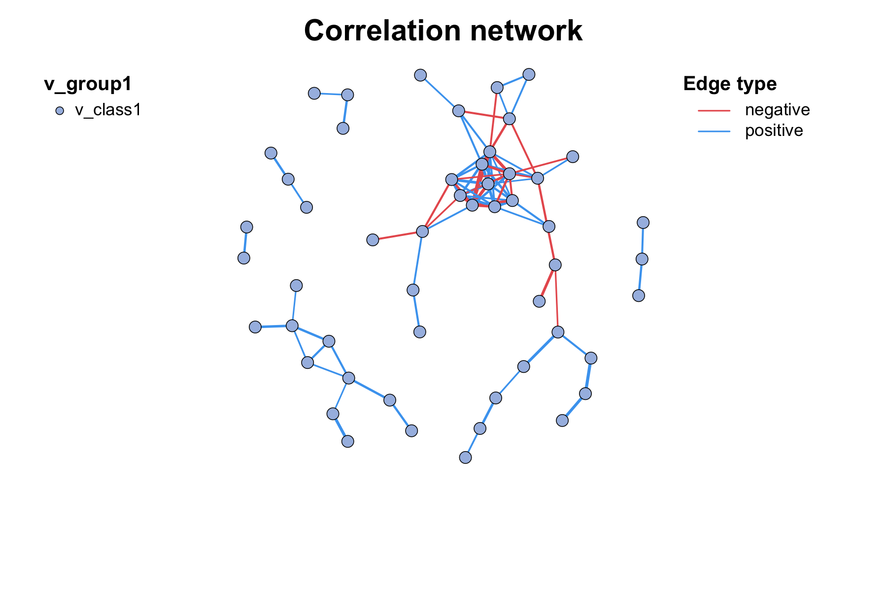
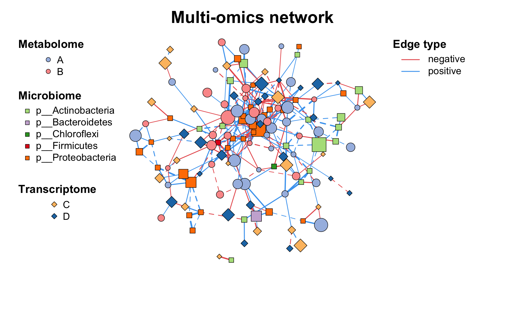
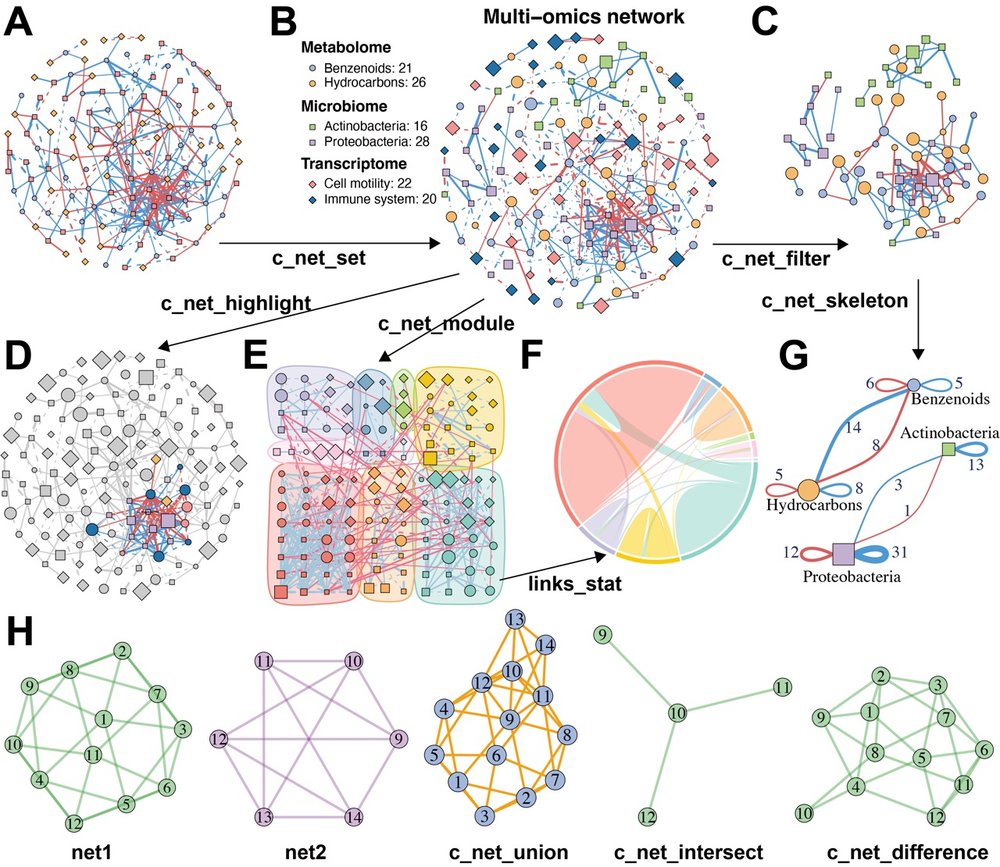
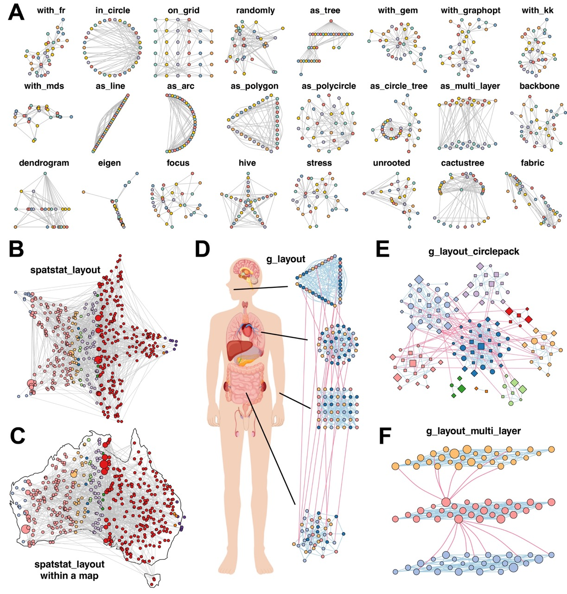
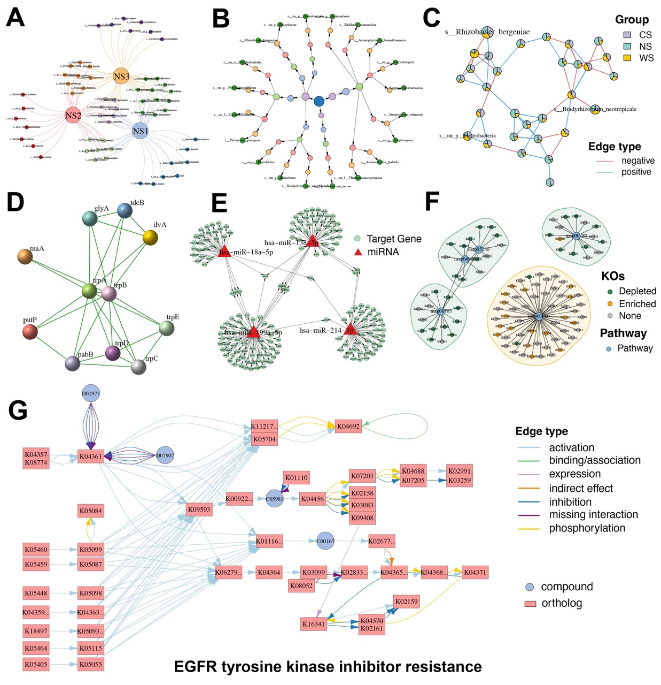

<!-- README.md is generated from README.Rmd. Please edit that file -->

# MetaNet 

<!-- badges: start -->

[](https://github.com/Asa12138/MetaNet/actions/workflows/R-CMD-check.yaml)
[](https://doi.org/10.1101/2025.06.26.661636)
[](https://asa-blog.netlify.app/)
[](https://cran.r-project.org/package=MetaNet)
[](https://cran.r-project.org/package=MetaNet)
[](https://cran.r-project.org/package=MetaNet)
[](https://github.com/Asa12138/MetaNet)

<!-- badges: end -->

MetaNet, a high-performance R package that unifies network construction,
visualization, and analysis across diverse omics layers.

MetaNet enables fast and scalable correlation-based network construction
for datasets with more than 10,000 features, providing over 40 layout
algorithms, rich annotation utilities, and visualization options
compatible with both static and interactive platforms. It further offers
comprehensive topological and stability metrics for in-depth network
characterization. Benchmarking shows that MetaNet delivers up to a
100-fold improvement in computation time and a 50-fold reduction in
memory usage compared to existing R packages.



The HTML documentation of the latest version is available at [Github
page](https://asa12138.github.io/MetaNet/).

## Citation

Please cite:

1.  Peng, C. et al. MetaNet: a scalable and integrated tool for
    reproducible omics network analysis. 2025.06.26.661636 Preprint at
    <https://doi.org/10.1101/2025.06.26.661636> (2025).

## Installation

You can install the released version of `MetaNet` from
[CRAN](https://CRAN.R-project.org) with:

``` r
install.packages("MetaNet")
```

You can install the development version of `MetaNet` from
[GitHub](https://github.com/) with:

``` r
# install.packages("devtools")
devtools::install_github("Asa12138/MetaNet")
```

## Tutorial📖

Please go to **<https://bookdown.org/Asa12138/metanet_book/>** for the
full vignette.



MetaNet is an R-based integrative package designed for comprehensive
network analysis across diverse omics data, including multi-omics
datasets. MetaNet is compatible with operating systems (Windows, macOS,
and Linux) that support R version 4.0 or higher, and its core
functionality is built upon the widely used igraph package. Its
architecture comprises several core functional modules: Calculation,
Manipulation, Layout, Visualization, Topology analysis, Module analysis,
Stability analysis, and I/O (Figure 1A), supporting the end-to-end
analytical process from network construction to visualization. Figure 1B
illustrates the main workflow and essential components within MetaNet.

Pairwise correlation computation is central to most network-based omics
tools, but the growing scale of omics datasets imposes substantial
computational demands. MetaNet addresses this through optimized
vectorized matrix algorithms for calculating correlation coefficients
and corresponding p-values, greatly reducing memory use and runtime
(Figure 1D).



**Figure 1. Overview of the MetaNet workflow and its high-efficiency
computation.**

## Quick Start

Simply build and draw a co-occurrence network plot, only need to use
`c_net_calculate()`, `c_net_build()`, `c_net_plot()` three functions:

``` r
library(pcutils)
library(MetaNet)
data("otutab", package = "pcutils")

# Inter-species correlation coefficients were calculated after transposition
totu <- t2(otutab[1:70, ])

cor <- c_net_calculate(totu)
net <- c_net_build(cor, r_threshold = 0.65)
#> Have not do p-value adjustment! use the p.value to build network.
c_net_plot(net)
```



Here is a more complex example of building and visualizing a multi-omics
network with MetaNet, we can use `c_net_set` to flexibly set vertex
attributes such as class and size, and then visualize the network with
`c_net_plot()`:

``` r
data("multi_test")
multi1 <- multi_net_build(list(Microbiome = micro, Metabolome = metab, Transcriptome = transc))
#> All samples matched.
#> All features are OK.
#> Calculating 18 samples and 150 features of 3 groups.
#> Have not do p-value adjustment! use the p.value to build network.
multi1 <- c_net_set(multi1, micro_g, metab_g, transc_g,
  vertex_class = c("Phylum", "kingdom", "type")
)
multi1 <- c_net_set(multi1, data.frame("Abundance1" = colSums(micro)),
  data.frame("Abundance2" = colSums(metab)), data.frame("Abundance3" = colSums(transc)),
  vertex_size = paste0("Abundance", 1:3)
)
c_net_plot(multi1)
```



For more detailed usage, please refer to the sections below or the full
vignette at **<https://bookdown.org/Asa12138/metanet_book/>**.

## Detailed usage

### Overview

#### Network construction

We use a multi-omics dataset to demonstrate the powerful network
manipulation capabilities of MetaNet. The dataset includes three omics
layers: microbiome, metabolome, and transcriptome, along with their
corresponding metadata.

``` r
data("multi_test")
v_color=setNames(c("#b2df8a","#cab2d6","#a6bce3","#fdbf6f","#fb9a99","#1f78b4"),
                 c("Actinobacteria","Proteobacteria","Benzenoids","Hydrocarbons","Cell motility","Immune system"))

# We create a simulated multi-omics dataset for demonstration purposes:
micro_g=micro_g[micro_g$Phylum%in%c("p__Actinobacteria", "p__Proteobacteria"),]
micro_g$Phylum=gsub(".__","",micro_g$Phylum)
micro=micro[,rownames(micro_g)]
metab_g$kingdom=tidai(metab_g$kingdom,c("Benzenoids","Hydrocarbons"))
transc_g$type=tidai(transc_g$type,c("Cell motility","Immune system"))
```

We first build a multi-omics network using `multi_net_build()` with a
specified correlation threshold, which will automatically calculate the
correlations and construct the network across all omics layers:

``` r
multi1 <- multi_net_build(list(Microbiome = micro,
                               Metabolome = metab,
                               Transcriptome = transc),r_threshold = 0.6)

# Figure 2A
c_net_plot(multi1,legend = F,main="",vertex.color=v_color)
```

#### Network annotation and filtering

In omics and multi-omics studies, networks are often annotated with
external data such as abundance profiles, taxonomy, or clinical
metadata. The `c_net_set` function attaches multiple annotation tables
to a network object and automatically configures visualization
properties (Figure 2B), including color schemes, line types, node
shapes, and legends.

``` r
multi1_with_anno <- c_net_set(multi1, micro_g, metab_g, transc_g,
                    vertex_class = c("Phylum", "kingdom", "type")
)
multi1_with_anno <- c_net_set(multi1_with_anno, 
                    data.frame("Abundance1" = colSums(micro)),
                    data.frame("Abundance2" = colSums(metab)), 
                    data.frame("Abundance3" = colSums(transc)),
                    vertex_size = paste0("Abundance", 1:3)
)
```

``` r
# Figure 2B
c_net_plot(multi1_with_anno,legend_number = T,vertex.color=v_color,
           edge.lty=c(4,1),vertex_size_range = c(4,9),
           lty_legend = T,size_legend = T,legend_cex = 1.2
           )
```

After annotation and customization, researchers may focus on specific
network regions—especially in multi-omics integration. The
`c_net_filter` function extracts sub-networks using flexible filters
(Figure 2C), while `c_net_highlight` visually emphasizes selected nodes
or edges (Figure 2D).

``` r
# filter the network to only show intra-omics correlations within microbiome and metabolome layers:
multi2 <- c_net_filter(multi1_with_anno, v_group %in% c("Microbiome","Metabolome")) %>% 
          c_net_filter(., e_class=="intra", mode="e")

# Figure 2C
c_net_plot(multi2,legend = F,main="",edge.lty=1,vertex.color=v_color)
```

``` r
degree(multi1)%>%sort(decreasing = T)%>%head()
core=c_net_neighbors(multi1_with_anno,"s__Dongia_mobilis")
c_net_highlight(multi1_with_anno,V(core)$name)->multi1_highlight
V(multi1_highlight)$label=ifelse(V(multi1_highlight)$label=="s__Dongia_mobilis",
                                 "s__Dongia_mobilis",NA)
# Figure 2D
c_net_plot(multi1_highlight,tmp_gephi$coors,legend = F,main="",
           labels_num = "all")
```

#### Module detection

Modules or communities—densely connected subgraphs—often represent
biologically meaningful groups. MetaNet supports module detection
through `c_net_module`, which includes multiple community detection
algorithms (Figure 2E).

``` r
c_net_module(multi1_with_anno)->multi1_module

g_layout_treemap(multi1_module)->coors1
c_net_plot(multi1_module,coors1,legend = F,main="",
           plot_module = T,mark_module = T,vertex.color=get_cols())
```

Resulting modules can be visualized with chord or Sankey diagrams to
show proportions and inter-module connections (Figure 2F). For
group-level analysis, the `c_net_skeleton` function summarizes edge
origins and targets across conditions, enhancing interpretability in
multi-condition or longitudinal datasets (Figure 2G).

``` r
links_stat(multi1_module,"module")

c_net_skeleton(multi2)%>%
  skeleton_plot(vertex.color=v_color,split_e_type = F,coors=in_circle(),
                legend=F,main="")
```



**Figure 2. MetaNet supports flexible and intuitive network
manipulation.**

#### Network comparison

Comparative analysis across multiple networks is also critical.
Researchers may identify differential edges between groups or track
stable subnetworks across transitions. MetaNet enables such comparisons
by computing intersections, unions, and differences between networks
(Figure 2H), offering a flexible framework for comparative and
evolutionary network analysis.

``` r
library(igraph)
set.seed(123)
g1 <- make_graph("Icosahedron")
V(g1)$color <- "#4DAF4A77"
E(g1)$color <- "#4DAF4A77"

g1=as.metanet(g1)

g2 <- make_graph("Octahedron")
V(g2)$name=as.character(9:14)
V(g2)$color <- "#984EA366"
E(g2)$color <- "#984EA366"

g2=as.metanet(g2)

# Perform network operations
g_union <- c_net_union(g1, g2)
E(g_union)$color<-"orange"
g_inter <- c_net_intersect(g1, g2)
g_diff <- c_net_difference(g1, g2)

par_ls=list(main = "",legend = F,vertex_size_range = c(20,20))
c_net_plot(g1, params_list = par_ls)
c_net_plot(g2, params_list = par_ls,coors = in_circle())
c_net_plot(g_union, params_list = par_ls,
           coors = transform_coors(c_net_layout(g_union),rotation = 90))
c_net_plot(g_inter , params_list = par_ls)
c_net_plot(g_diff, params_list = par_ls)
```

### Layout and Visualization

#### Basic layouts

Layout is a critical component of network visualization, as a
well-designed layout can significantly enhance the interpretability of
network structures. MetaNet stores layout coordinates in a flexible
`coors` object, allowing users to control, reuse, and transfer layout
settings. The `c_net_layout` function provides access to over 40 layout
algorithms (Figure 3A), including several new layouts as well as
adaptations from `igraph` and `ggraph` packages.

``` r
net=make_graph("Zachary")
net=as.metanet(net)
V(net)$color=rep(get_cols(6),length=length(net))

layout_methods <- list(
  with_fr(), in_circle(), on_grid(), randomly(), as_tree(),
  with_gem(), with_graphopt(), with_kk(), with_mds(), 
  as_line(angle = 45), as_arc(), as_polygon(), as_polycircle(3), as_circle_tree(),
  as_multi_layer(2)
)
names(layout_methods) <- c(
  "with_fr", "in_circle", "on_grid", "randomly","as_tree", 
  "with_gem", "with_graphopt", "with_kk","with_mds", 
  "as_line", "as_arc","as_polygon", "as_polycircle", "as_circle_tree",
  "as_multi_layer"
)

layout_methods2 <- c(
  'backbone', 'dendrogram', 'eigen', 'focus', 'hive', 
  'stress', 'unrooted', "cactustree", "fabric")

par(mfrow = c(4, 6),mar = c(0.5, 0.5, 0.5, 0.5))
for (i in names(layout_methods)) {
  c_net_plot(net, coors = layout_methods[[i]], 
             edge.color="grey",vertex_size_range = c(10,10),edge_width_range = c(0.8,0.8),
             legend = F, main = i, labels_num = 0,
             rescale = (i=="as_tree"))
}

for (i in layout_methods2) {
  if(i=="focus")coors = c_net_layout(clean_igraph(net),"focus",focus=4)
  else if(i=="hive")coors=c_net_layout(clean_igraph(net),"hive",axis=1:5)
  else if (i=="pmds")coors=c_net_layout(clean_igraph(net),"pmds",pivots=15)
  else coors = c_net_layout(
    clean_igraph(net,direct = i%in%c("dendrogram","partition","treemap","cactustree")),
    i)
  c_net_plot(net, coors = coors, 
             edge.color="grey",vertex_size_range = c(10,10),edge_width_range = c(0.8,0.8),
             legend = F, main = i, labels_num = 0,
             rescale = T)
}
```



**Figure 3. MetaNet enables diverse and powerful network layout
strategies.**

#### spatstat layouts

In addition to conventional layouts, MetaNet introduces the
`spatstat_layout` method, which constrains layout generation within a
user-defined polygon or along its edges. This layout function supports
uniform or random node distributions inside custom shapes. For example,
arranging a network within a star (Figure 3B) or mapping it to a
geographic region like Australia (Figure 3C).

``` r
library(spatstat.geom)

create_star_window <- function(r_outer = 1, r_inner = 0.4, center = c(0, 0)) {
  # 创建五角星的10个顶点（外、内交替）
  theta <- seq(0, 2 * pi, length.out = 11)[-11]  # 10个点
  theta_outer <- theta[seq(1, 10, 2)]
  theta_inner <- theta[seq(2, 10, 2)]

  x <- c(r_outer * cos(theta_outer),
         r_inner * cos(theta_inner))
  y <- c(r_outer * sin(theta_outer),
         r_inner * sin(theta_inner))

  # 重新排序成首尾相连的路径
  order_index <- c(1,6,2,7,3,8,4,9,5,10)
  x <- x[order_index] + center[1]
  y <- y[order_index] + center[2]

  # 构建 spatstat 的 owin 窗口
  win <- owin(poly = list(x = x, y = y))
  return(win)
}

win_star <- create_star_window()

tmp_net=erdos.renyi.game(400,p.or.m = 0.005)%>%as.metanet()

c_net_plot(co_net, coors = spatstat_layout(co_net, win_star, order_by="v_class"),
     legend=F,edge.color="grey",main="spatstat_layout",edge.width=0.3)
```

#### Group and multi-level layouts

For networks with grouping variables, MetaNet offers an advanced
interface via `g_layout`. Users can define spatial configurations for
each group, including positioning, scaling, and internal layout
strategies, and combine multiple layout types in one visualization.

The resulting `coors` object can be nested or recombined with subsequent
calls to create highly customized multi-level layouts. For example, a
co-abundance network across multiple human body sites can be arranged
with a single `g_layout` call (Figure 3D). This strategy is also useful
for highlighting modular structures. `g_layout_circlepack` visualizes
module distribution using compact circular packing (Figure 3E), while
`g_layout_multi_layer` introduces a pseudo-3D representation emphasizing
inter-module relationships (Figure 3F).

``` r
set.seed(12)
igraph::sample_islands(4,40,0.15,3)%>%as.metanet()%>%c_net_module()->test_net
test_net=to_module_net(test_net)

V(test_net)$v_class=sample(letters[1:4],size = length(test_net),replace = T)
test_net=c_net_set(test_net)
c_net_plot(test_net,plot_module = F)

g_coors=g_layout(test_net,group = "module",
                 layout1 = data.frame(X=c(0,0.3,0.3,0),Y=c(0,2:4)),
                 layout2 = list(with_fr(),on_grid(),as_polycircle(3),as_polygon(3)),
                 zoom2 = c(1.3,1,1,1.3)*3
                 )

img <-png::readPNG("body.png")

# Figure 3D
pdf("3.g_layout.pdf",height = 8,width = 5)
par(xpd = TRUE)
plot(NA, xlim = c(-1, 1), ylim = c(-1, 1), axes = F, asp = 1,xlab = "", ylab = "")
rasterImage(bg_img, -1, -1.2, -0.4, 1.2,interpolate = F)
par(new = TRUE)
c_net_plot(test_net,coors = g_coors,plot_module = F,legend = F,main="",vertex.size=2)

segments(
  x0 = c(-0.52,-0.3,-0.42,-0.6), y0 = c(0.1,0.1,0.5,0.78),
  x1 = c(-0.2,-0.1,-0.12,-0.25), y1 = c(-0.63,0,0.45,0.8),
  col = "black", lwd = 1.5
)
dev.off()
```

``` r
set.seed(12)
E(co_net)$color <- rep("grey", length(E(co_net)))
coors=g_layout_circlepack(multi1_module, group = "module")

# Figure 3E
pdf("3.g_layout_circlepack.pdf",height = 7,width = 10)
c_net_plot(multi1_module, 
           coors = transform_coors(coors,rotation = 130),edge.lty=1,edge.width=0.5,
           legend = F, labels_num = 0, main = "g_layout_circlepack",
           plot_module = T,mark_module = F,vertex_size_range = c(3,8))
dev.off()
```

``` r
set.seed(112)
igraph::sample_islands(3,30,0.15,0)%>%as.metanet()%>%c_net_module()->test_net

test_net=to_module_net(test_net)
test_net=add_edges(test_net,c(25,61,25,63,25,75,25,88,25,79,25,66))
test_net2=add_edges(test_net,c(4,56,4,57,4,60,4,48,4,51,4,55,4,32))

get_e(test_net2)->tmp_e
tmp_e$width=1
tmp_e$lty=1
tmp_e$color=ifelse(is.na(tmp_e$color),"#FA789A",tmp_e$color)

edge.attributes(test_net2)=as.list(tmp_e)
V(test_net2)$size=V(test_net2)$degree=degree(test_net2)

# Figure 3F
pdf("3.multi_layer.pdf",height = 5)
plot(as.metanet(test_net2),
  coors = g_layout_multi_layer(test_net, group = "v_class", layout = on_grid()),
  legend = F, labels_num = 0, main = "g_layout_multi_layer",
  edge.curved=ifelse(is.na(tmp_e$e_type),0.2,0)
)
dev.off()
```

### Biological networks

MetaNet provides native support for a variety of specialized network
types frequently used in bioinformatics workflows, enabling researchers
to visualize and explore biological relationships beyond conventional
correlation or interaction networks.

#### venn

MetaNet allows the construction of Venn-style networks to illustrate set
relationships across sample groups. These provide a more informative
alternative to traditional Venn diagrams by displaying explicit
connections and network structure (Figure 4A).

``` r
data(otutab, package = "pcutils")
tab <- otutab[420:485, 1:3]
venn_net(tab) -> v_net

# Figure 4A
pdf("3-1.venn_network.pdf",width = 5,height = 5)
plot(v_net, vertex_size_range=list("Group" = c(18, 18),"elements" = c(4, 4)),
     edge.width=.5,vertex.frame.width=0.3)
dev.off()
```

#### tree

Tree-structured data, such as taxonomies or gene ontology hierarchies,
can be visualized using the built-in “as_circle_tree” layout, offering a
clear and compact representation of hierarchical relationships (Figure
4B).

``` r
data("otutab", package = "pcutils")
cbind(taxonomy, num = rowSums(otutab))[1:20, ] -> test
df2net_tree(test) -> ttt

# Figure 4B
pdf("3-1.circle_tree_network.pdf",width = 5,height = 5)
plot(ttt, coors = as_circle_tree(), legend = F, main = "Circle tree network",
  edge.arrow.size = 0.3,edge.arrow.width = 0.6,rescale=T,vertex.label=ifelse(
    V(ttt)$v_class %in% c("Species"), V(ttt)$name, NA),edge.color="black",edge.width=0.4
  )
dev.off()
```

#### pie

MetaNet further supports pie-node visualization, where each node encodes
multivariate annotations, such as group-specific abundances. This
approach allows compositional data to be embedded directly in the
network structure (Figure 4C).

``` r
data("otutab")
data("c_net")
hebing(otutab, metadata$Group) -> otutab_G

V(co_net)$degree=degree(co_net)
co_net_f=c_net_filter(co_net,degree>6,degree<15)

# Figure 4C
pdf("3-1.pie_network.pdf",width = 5,height = 5)
c_net_plot(co_net_f,pie_value=otutab_G,vertex.shape=c("pie"),
    pie_legend=T,color_legend=F,vertex_size_range=c(10,15),labels_num = 3,
    pie_legend_title = "Group")
dev.off()
```

#### STRING database

Beyond generic network types, MetaNet is compatible with biological
networks from external databases. For example, protein–protein
interaction (PPI) networks obtained from the STRING database can be
imported and visualized with customized layout and annotations (Figure
4D).

``` r
read.table("~/Downloads/string_interactions.tsv",comment.char = "",header = TRUE, sep = "\t") -> interactions
colnames(interactions)[1]="node1"

c_net_from_edgelist(interactions)-> net

V(net)$color=get_cols(length(V(net)),"col1")%>%add_alpha(0.5)
coors=c_net_layout(net)%>%transform_coors(mirror_y = T,mirror_x = T)

# Figure 4D
pdf("3-1.string_network.pdf",width = 5,height = 5)
c_net_plot(net,coors,edge.curved=0,vertex.shape="sphere",vertex.size=20,edge.width=1,
           vertex.label.cex=1,vertex.label.dist=2,legend = F,edge.color="green4")
dev.off()
```

#### miRNA-Gene networks

Similarly, miRNA–target gene regulatory networks from miRTarBase, which
are experimentally validated, can be represented to explore
post-transcriptional regulatory mechanisms (Figure 4E).

``` r
readxl::read_excel("~/database/hsa_MTI.xlsx") -> miRNA_target
filter(miRNA_target,`Support Type`=="Functional MTI") -> miRNA_target
distinct(miRNA_target,`miRNA`,`Target Gene`,.keep_all = T) -> miRNA_target

miRNA_target %>%
  select(`miRNA`,`Target Gene`)%>%
  filter(miRNA%in%c("hsa-miR-18a-5p","hsa-miR-199a-5p","hsa-miR-138-5p","hsa-miR-214-3p"))-> miRNA_target_f

c_net_from_edgelist(miRNA_target_f,direct = T)-> miRNA_net
simplify(miRNA_net) -> miRNA_net

# Figure 4E
pdf("3-1.miRNA_network.pdf",width = 6,height = 5)
c_net_plot(miRNA_net,vertex_size_range = list(c(10,10),c(4,4)),vertex.shape=c("triangle1","circle"),
           edge_legend = F,vertex.color=c("miRNA"="#E41A1C","Target Gene"="#A8DEB5"),labels_num = "all",
           edge.color="black",edge.width=.3,vertex.frame.width=0.2)
dev.off()
```

#### Enrichment

MetaNet also integrates with the ReporterScore, an R package we
previously developed for functional enrichment analysis. Using the
results of pathway enrichment, users can directly visualize
relationships between KEGG orthologs (KOs) and their associated pathways
(Figure 4F).

``` r
library(ReporterScore)
data("reporter_score_res")
# View(reporter_score_res$reporter_s)

# Figure 4F
pdf("3-1.enrichment_network.pdf",width = 6,height = 5)
plot_features_network(reporter_score_res, map_id = c("map00780","map00785","map03010","map05230","map04922"),
                      mark_module = T,near_pathway = F)
dev.off()
```

#### KEGG pathway

Furthermore, MetaNet supports direct rendering of any KEGG pathway map
through a specified pathway ID, enabling fully annotated and modifiable
visualizations (Figure 4G).

``` r
library(ReporterScore)

path_net_c <- c_net_from_pathway_xml("~/Documents/R/GRSA/ReporterScore_temp_download/ko01521.xml")
coors=get_v(path_net_c)[,c("name","x","y")]
colnames(coors)=c("name","X","Y")
coors=rescale_coors(as_coors(coors))
coors=transform_coors(coors,aspect_ratio = 0.6)

coors[11,c("X","Y")]=c(-0.75,0.7) #adjust the position of the "map" node

get_v(path_net_c)->tmp_v

# Figure 4G
plot_pathway_net(path_net_c,coors=coors,label_cex=0.6,
                 vertex.frame.width=0.2,arrow_size_cex=2,arrow_width_cex=2,
                 edge.width=0.5)
```



**Figure 4. Diverse specialized network visualizations by MetaNet.**

For more detailed usage, please refer to the full vignette at
**<https://bookdown.org/Asa12138/metanet_book/>**.
